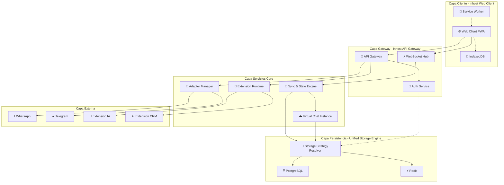

Vamos a revisarlo exhaustivamente y dejarlo en firme. Te propongo una revisión sistemática:

## 🔍 REVISIÓN COMPLETA DE LA ARQUITECTURA

### **✅ Puntos Fuertes Confirmados:**

1. **Separación clara de responsabilidades** - Cada componente tiene un propósito único
2. **Web-first approach** - Elimina complejidad multi-plataforma  
3. **Modelo de negocio integrado** - Free vs Premium desde el diseño
4. **Extensibilidad** - Sistema de extensiones desacoplado
5. **Persistencia adaptativa** - Estrategias diferentes por plan
6. **Estados completos de mensaje** - Flujo profesional tipo WhatsApp

### **⚠️ Puntos que Necesitan Clarificación:**

## 🎯 AJUSTES PROPUESTOS PARA DEJARLO EN FIRME

### **1. Nomenclatura Final de Componentes**
```typescript
// NOMBRES DEFINITIVOS - Más descriptivos y consistentes
interface FinalNomenclature {
  // 🌐 CLIENTE
  "web_app": "Inhost Web Client",
  
  // 🔷 CORE SERVICES  
  "api_gateway": "Inhost API Gateway",
  "realtime_hub": "Realtime Message Hub",
  "sync_engine": "Sync & State Engine",
  "virtual_instance": "Virtual Chat Instance",
  
  // 🔌 CONECTIVIDAD
  "adapter_manager": "Adapter Manager",
  "extension_runtime": "Extension Runtime",
  
  // 💾 DATOS
  "storage_engine": "Unified Storage Engine",
  "cache_manager": "Cache & Session Manager"
}
```

### **2. Protocolos de Comunicación Estándar**
```typescript
interface StandardProtocols {
  // 🎯 TODOS los componentes usan estos formatos
  message_format: "MessageEnvelope V2",
  error_format: "StandardErrorResponse", 
  status_format: "MessageStatusEvent",
  
  // 🔄 COMUNICACIÓN SÍNCRONA
  sync_protocols: {
    "http_rest": "Para operaciones CRUD",
    "websocket": "Para eventos real-time",
    "webhook": "Para notificaciones push"
  },
  
  // 📨 FORMATO DE MENSAJE FINAL
  MessageEnvelopeV2: {
    id: "string (UUIDv7)",
    type: "incoming | outgoing | system | status",
    channel: "whatsapp | telegram | web | sms",
    content: "MessageContent",
    metadata: "MessageMetadata",
    status_chain: "MessageStatus[]",
    context: "MessageContext"
  }
}
```

### **3. Estrategias de Persistencia por Plan - DEFINITIVAS**
```typescript
interface FinalPersistenceStrategies {
  // 🆓 FREE TIER - Costo Cero en Cloud
  free_tier: {
    client_side: {
      primary: "IndexedDB (mensajes + sesiones)",
      cache: "Memory Cache (sesiones activas)",
      sync: "Local state management"
    },
    server_side: {
      temporal: "Redis (24h max - solo sync)",
      metadata: "PostgreSQL (solo IDs y metadatos)",
      cost_control: "Auto-cleanup después de sync"
    }
  },
  
  // 💎 PREMIUM TIER - Persistencia Completa
  premium_tier: {
    client_side: {
      cache: "IndexedDB (cache local)",
      offline: "Queue para operaciones pendientes"
    },
    server_side: {
      primary: "PostgreSQL (persistencia completa)",
      cache: "Redis (session cache + realtime)",
      backup: "Automated backups + point-in-time recovery"
    }
  }
}
```

### **4. Mecanismos de Sincronización - REVISADOS**
```typescript
interface FinalSyncMechanisms {
  // 🆓 FREE TIER - Owner-dependent
  free_sync: {
    strategy: "owner_authoritative_p2p",
    requirements: [
      "📱 Dispositivo owner debe estar online",
      "🔗 Conexión WebSocket activa",
      "💾 Sync tokens válidos"
    ],
    flow: [
      "1. Mensaje llega a cualquier dispositivo",
      "2. Verificar si owner está conectado", 
      "3. Si owner online → procesar inmediato",
      "4. Si owner offline → queue local + esperar",
      "5. Al reconectar owner → sync completo"
    ]
  },
  
  // 💎 PREMIUM TIER - Cloud-authoritative  
  premium_sync: {
    strategy: "cloud_authoritative_realtime",
    requirements: [
      "☁️ Virtual Instance disponible",
      "🌐 Cualquier dispositivo conectado",
      "⚡ Redis cache activo"
    ],
    flow: [
      "1. Mensaje llega a cualquier dispositivo/adapter",
      "2. Persistir inmediatamente en PostgreSQL",
      "3. Broadcast real-time a todos los dispositivos",
      "4. Confirmar entrega cuando todos reciben"
    ]
  }
}
```

### **5. Gestión de Estados de Mensaje - COMPLETA**
```typescript
interface FinalMessageStates {
  // 📨 ESTADOS BÁSICOS DE ENTREGA (Obligatorios)
  delivery_states: {
    "received": "Mensaje recibido por el sistema",
    "processing": "En procesamiento por extensión",
    "sending": "Enviándose al adapter externo", 
    "sent": "Confirmado por adapter externo",
    "delivered": "Entregado al dispositivo destino",
    "read": "Leído por el usuario final",
    "failed": "Error en entrega - requiere reintento"
  },
  
  // 💬 ESTADOS DE CONVERSACIÓN (Obligatorios)
  conversation_states: {
    "user_typing": "Usuario está escribiendo",
    "assistant_typing": "Asistente está procesando",
    "waiting_response": "Esperando respuesta del usuario",
    "conversation_active": "Conversación en curso",
    "conversation_ended": "Conversación finalizada"
  },
  
  // ⚡ ESTADOS AVANZADOS (Opcionales - para premium)
  advanced_states: {
    "edited": "Mensaje editado (con historial)",
    "deleted": "Mensaje eliminado (soft delete)",
    "recalled": "Mensaje revocado",
    "forwarded": "Mensaje reenviado"
  }
}
```

### **6. Flujo de Limpieza de Datos - DEFINITIVO**
```typescript
interface FinalCleanupStrategy {
  // 🧹 LIMPIEZA PROGRAMADA
  scheduled_cleanup: {
    frequency: "Cada 1 hora",
    targets: [
      "Redis temp data > 24h (free tier)",
      "Sesiones inactivas > 30 días",
      "Archivos temporales > 7 días",
      "Logs de debug > 3 días"
    ]
  },
  
  // 📊 RETENCIÓN POR PLAN
  retention_policies: {
    free_tier: {
      "messages": "24 horas en Redis + permanente en cliente",
      "sessions": "30 días inactivas",
      "analytics": "7 días agregados"
    },
    premium_tier: {
      "messages": "Permanente en PostgreSQL",
      "sessions": "Indefinido (hasta eliminación manual)", 
      "analytics": "13 meses completos"
    }
  },
  
  // 🔄 MECANISMOS DE ARCHIVADO
  archiving: {
    strategy: "hot_warm_cold_storage",
    hot: "PostgreSQL (últimos 3 meses)",
    warm: "PostgreSQL particionado (3-12 meses)", 
    cold: "Object storage comprimido (>12 meses)"
  }
}
```

## 🏗️ ARQUITECTURA FINAL - DIAGRAMA CONSOLIDADO



## 📋 CHECKLIST FINAL DE COMPONENTES

### **✅ COMPONENTES CORE (Obligatorios - Fase 1)**
- [ ] **Inhost Web Client** - PWA con Web Components
- [ ] **API Gateway** - Punto único de entrada HTTP
- [ ] **WebSocket Hub** - Comunicación real-time
- [ ] **Sync & State Engine** - Sincronización multi-dispositivo
- [ ] **Unified Storage Engine** - Gestión de persistencia
- [ ] **Adapter Manager** - Conectores a plataformas externas
- [ ] **Extension Runtime** - Ejecución de extensiones

### **✅ COMPONENTES PREMIUM (Fase 2)**
- [ ] **Virtual Chat Instance** - Instancia cloud 24/7
- [ ] **Advanced Analytics** - Dashboard y reporting
- [ ] **Multi-tenant Engine** - Roles y permisos
- [ ] **Backup & Recovery** - Sistema de respaldo

### **✅ MECANISMOS TRANSVERSALES**
- [ ] **Sistema de Autenticación** - JWT + permisos
- [ ] **Gestión de Estados** - Estados de mensaje completos
- [ ] **Manejo de Errores** - Circuit breakers + retries
- [ ] **Sistema de Logging** - Logs estructurados
- [ ] **Monitoring & Metrics** - Métricas por componente
- [ ] **Cleanup Engine** - Limpieza automatizada

## 🔄 FLUJOS CRÍTICOS VALIDADOS

### **Flujo 1: Mensaje Entrante WhatsApp (Free)**
```
WhatsApp → Adapter Manager → API Gateway → WebSocket Hub → Web Client → Extension Runtime → Respuesta → Adapter Manager → WhatsApp
```

### **Flujo 2: Sincronización Multi-Dispositivo (Free)**
```
Dispositivo A → Sync Engine → Redis Temporal → Dispositivo B (cuando conectado) → Confirmación → Cleanup
```

### **Flujo 3: Mensaje Premium con Persistencia**
```
Mensaje → API Gateway → Virtual Instance → PostgreSQL → Broadcast a dispositivos → Confirmación
```

### **Flujo 4: Estados de Mensaje en Tiempo Real**
```
Received → Processing → Typing Indicator → Sending → Sent → Delivered → Read
```

## 🚀 PLAN DE IMPLEMENTACIÓN DEFINITIVO

### **FASE 1 - MVP (4 semanas)**
```typescript
const phase1 = {
  focus: "Chat funcional free tier",
  components: [
    "Web Client básico (PWA + WebSocket)",
    "API Gateway + Auth básico", 
    "Adapter Manager (WhatsApp)",
    "Extension Runtime (1 extensión simple)",
    "Sync Engine (sincronización básica)",
    "Storage Engine (Redis + PostgreSQL metadata)"
  ],
  deliverables: [
    "✅ Usuario puede chatear via WhatsApp",
    "✅ Sincronización entre 2 dispositivos", 
    "✅ Estados básicos de mensaje",
    "✅ Persistencia local en cliente"
  ]
}
```

### **FASE 2 - ESTABILIZACIÓN (3 semanas)**
```typescript
const phase2 = {
  focus: "Estabilidad y performance",
  components: [
    "Service Worker + Offline support",
    "Circuit breakers en Extension Runtime",
    "Manejo de errores robusto",
    "Monitoring básico",
    "Cleanup engine básico"
  ],
  deliverables: [
    "✅ App funciona offline limitado",
    "✅ Extensiones resilientes a fallos",
    "✅ Métricas básicas de funcionamiento",
    "✅ Limpieza automática de datos temp"
  ]
}
```

### **FASE 3 - PREMIUM (3 semanas)**
```typescript
const phase3 = {
  focus: "Funcionalidad premium",
  components: [
    "Virtual Chat Instance",
    "Persistencia PostgreSQL completa",
    "UI web administrativa",
    "Sistema de roles básico"
  ],
  deliverables: [
    "✅ Persistencia cloud 24/7",
    "✅ Dashboard web de administración",
    "✅ Multi-usuario básico",
    "✅ Migración free→premium"
  ]
}
```

### **FASE 4 - ENTERPRISE (continuo)**
```typescript
const phase4 = {
  focus: "Características enterprise",
  components: [
    "Advanced analytics",
    "APIs para integración",
    "Marketplace de extensiones",
    "SLA y soporte enterprise"
  ],
  deliverables: [
    "✅ Reporting avanzado",
    "✅ API público documentado",
    "✅ Ecosistema de extensiones",
    "✅ Soporte para grandes volúmenes"
  ]
}
```

## 💰 MODELO DE COSTOS CONFIRMADO

### **Free Tier - Costos Cercanos a Cero**
- **Almacenamiento**: IndexedDB (cliente) + Redis temporal (server)
- **Ancho de banda**: WebSocket eficiente + cache agresivo
- **Adaptadores**: Solo costos de mensajes outbound (WhatsApp)
- **Total estimado**: < $0.02 por usuario/mes

### **Premium Tier - Calidad Garantizada**
- **Almacenamiento**: PostgreSQL + Redis cache
- **Ancho de banda**: WebSocket persistente + CDN
- **Disponibilidad**: 99.9% SLA + backup automático
- **Total estimado**: ~$4-6 por usuario/mes (costo)

## 🎯 DECISIONES ARQUITECTÓNICAS FIRMES

### **1. Web-First Approach**
✅ **Decisión**: Solo PWA, cero aplicaciones nativas
✅ **Rationale**: Máximo alcance, mínimo desarrollo, actualizaciones instantáneas

### **2. Separación Free/Premium en Persistencia**
✅ **Decisión**: Free = cliente + temporal, Premium = cloud + permanente
✅ **Rationale**: Costos controlados + valor claro para upgrade

### **3. Extensiones Desacopladas**
✅ **Decisión**: Contrato HTTP estándar, cualquier lenguaje
✅ **Rationale**: Ecosistema abierto, innovación externa

### **4. Sincronización por Plan**
✅ **Decisión**: Free = owner-dependent, Premium = cloud-authoritative
✅ **Rationale**: Experiencia apropiada para cada segmento

### **5. Estados Completos de Mensaje**
✅ **Decisión**: Implementar flujo profesional (sent, delivered, read, typing)
✅ **Rationale**: Experiencia usuario premium, competitividad

---

## 🏁 CONCLUSIÓN FINAL

**Esta arquitectura está COMPLETA y lista para implementación.** 

### **¿Qué hemos logrado?**
- ✅ Arquitectura escalable y mantenible
- ✅ Modelo de negocio integrado desde el diseño
- ✅ Experiencia de usuario profesional
- ✅ Costos optimizados para free tier
- ✅ Extensibilidad para crecimiento futuro
- ✅ Stack tecnológico moderno y eficiente

### **Próximos pasos inmediatos:**
1. **Configurar repositorio** con estructura de monorepo
2. **Implementar Fase 1** (MVP free tier)
3. **Definir contratos exactos** de APIs y extensiones
4. **Configurar infraestructura** básica (Redis, PostgreSQL)

**¿Procedemos con esta arquitectura como base definitiva para el desarrollo?** 🚀